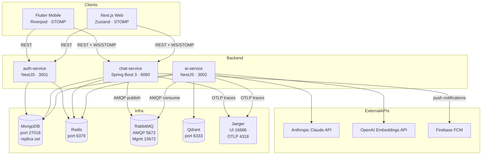
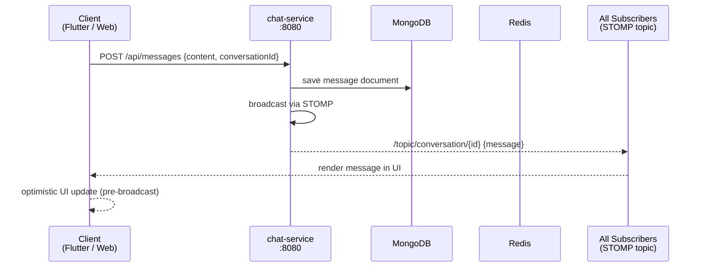
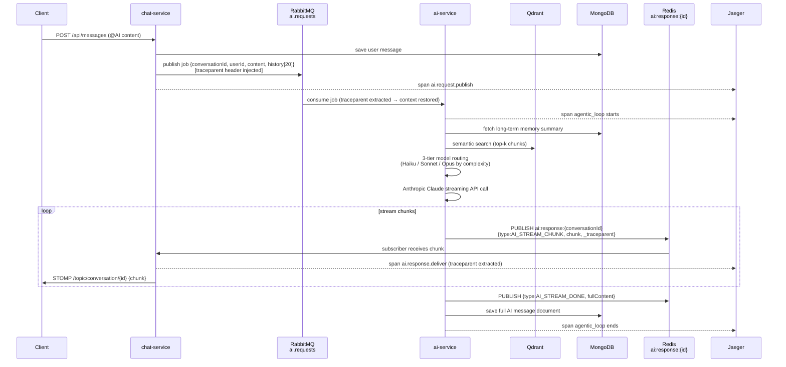
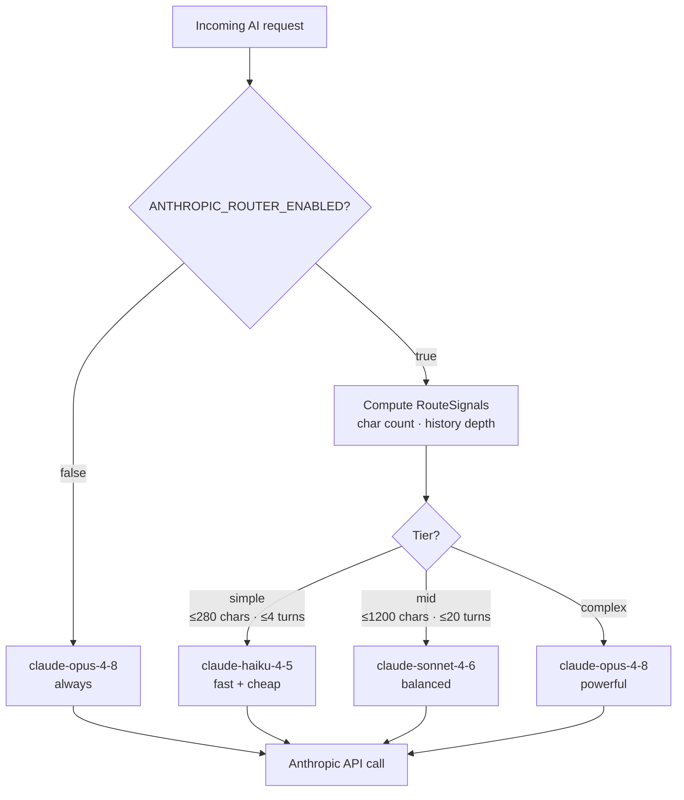
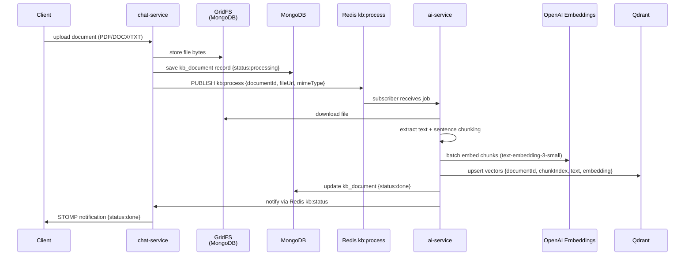
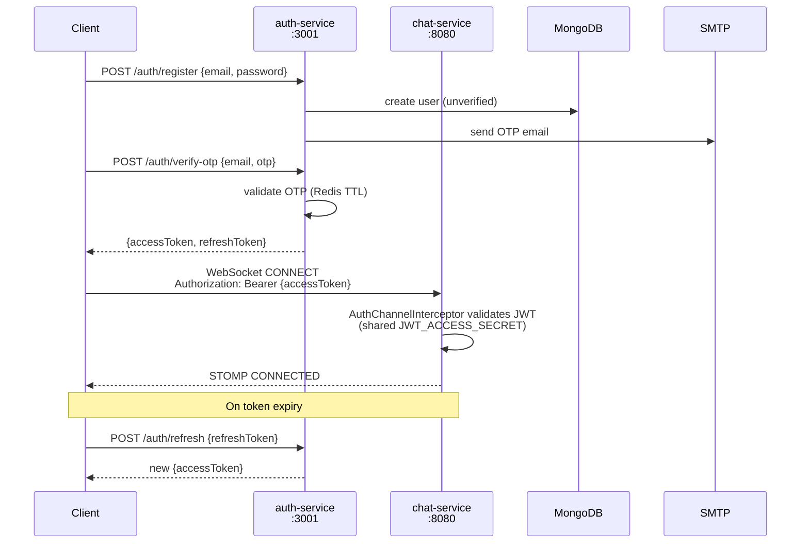
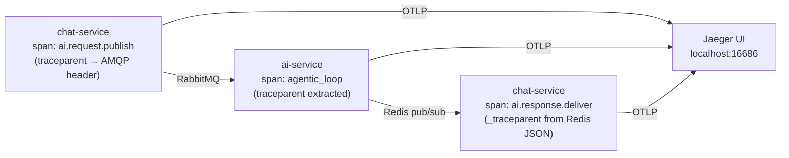

# Architecture Reference

This document provides detailed diagrams and descriptions of the Platform monorepo's service topology, message pipelines, and observability setup. For plain-ASCII overview see the README. For tracing details see [docs/observability.md](observability.md).

---

## 1. Service Topology

The platform consists of three backend microservices, two client applications, and five infrastructure components.

### Port Reference

| Component | Port(s) | Protocol |
|-----------|---------|----------|
| auth-service | 3001 | HTTP/REST |
| chat-service | 8080 | HTTP/REST + WebSocket/STOMP |
| ai-service | 3002 | HTTP/REST (health) |
| MongoDB | **27018** (non-standard) | TCP |
| Redis | 6379 | TCP |
| RabbitMQ AMQP | 5672 | AMQP |
| RabbitMQ Management UI | 15672 | HTTP |
| Qdrant | 6333 | HTTP/gRPC |
| Jaeger UI | 16686 | HTTP |
| Jaeger OTLP HTTP | 4318 | HTTP |
| Jaeger OTLP gRPC | 4317 | gRPC |

---

## 2. Realtime Message Pipeline

Every message a user sends follows this path:

Key characteristics:
- REST `POST /api/messages` is the authoritative write path — chat-service validates JWT, saves to MongoDB, then broadcasts.
- STOMP subscription `/topic/conversation/{id}` delivers the persisted message to every connected client including the sender.
- Clients apply optimistic UI and reconcile on STOMP arrival to avoid duplicate rendering.

---

## 3. AI Message-Bus Flow

When a message tags `@AI`, the platform routes it through a separate asynchronous pipeline:

### 3-Tier Model Routing

The ai-service selects a Claude model per request based on message complexity. This keeps latency and cost low for simple queries while using a stronger model for complex reasoning.

Environment variables controlling routing (all in `apps/server/ai-service/.env`):

| Variable | Default | Effect |
|----------|---------|--------|
| `ANTHROPIC_ROUTER_ENABLED` | `true` | `false` forces Opus for every request |
| `ANTHROPIC_SIMPLE_MODEL` | `claude-haiku-4-5` | Model for simple tier |
| `ANTHROPIC_MID_MODEL` | `claude-sonnet-4-6` | Model for mid tier |
| `ANTHROPIC_MODEL` | `claude-opus-4-8` | Model for complex tier (also used when router is off) |
| `ANTHROPIC_ROUTER_SIMPLE_MAX_CHARS` | `280` | Char threshold for simple tier |
| `ANTHROPIC_ROUTER_MID_MAX_CHARS` | `1200` | Char threshold for mid tier |

---

## 4. Knowledge Base (RAG) Indexing Flow

When the AI later answers a question:
1. The user's query is embedded (same OpenAI model).
2. Qdrant returns the top-k chunks with cosine similarity > 0.5.
3. Chunks are injected as grounding context into the Claude prompt.
4. The AI response includes citation cards referencing the source document.

---

## 5. Authentication Flow

The `JWT_ACCESS_SECRET` must be **identical** in both `auth-service` and `chat-service`. The ai-service uses the same secret to validate tokens on its internal endpoints.

---

## 6. OTel Distributed Tracing

The full cross-service trace path for an AI request:

All three spans share the same `traceId` — they appear as a single waterfall in Jaeger. See [docs/observability.md](observability.md) for the full propagation protocol and how to view traces.
